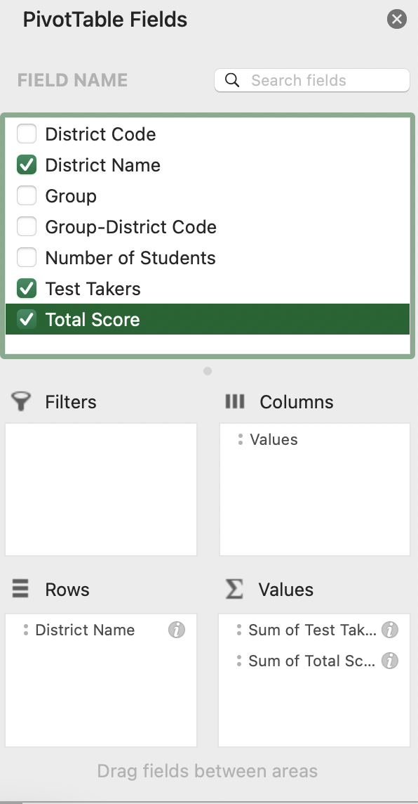

## Introduction

### Intro

*Getting familiar with basic objects in Excel* 

- [ ] **Open new workbook**
Choose File -> New in the Excel menu or press Ctrl+N (Cmd+N on Mac)

- [ ] **Create new worksheet.**

  In the opened workbook click on a plus in the bottom panel on the left 

  

- [ ] Read more about difference between Workbook and Worksheet objects [SOURCE]

### Data Types

*Switching between data types*

Most of the data is defined as a General type, unless specified otherwise. To learn what type a specific column is, select the range of values and check the dropdown list value in the Home tab. 

**Hint**: the default alignment used by Excel suggests the data type too: numbers are aligned to the right, while text is aligned to the left.

- [ ] **What type is `Group` column?**

- [ ] **What type is `District Code` column?**

- [ ] **Change `District Code` column to be Text**. 

  Select values in `District Code` column (or select all the values in the column by clicking on the `A` in the column names pane) and then select **Text** instead of General

  

### Number as Dates

*How to avoid having numbers stored as dates*

- [ ] **Try to put `1-20` in the first row of the `Group-District Code` column**

- [ ] **Select filled cell (`D5`) and change type to be Text. Did it work?**

  Unfortunately, Excel does not allow to switch between dates and text after the transformation has been done. However, we may prevent the automatic switch to the date format by choosing the format of column. 

- [ ] **Delete the value in the cell. Change the `Group-District Code`  column to be Text. Now. fill the first 5 values manually following the pattern (`1-20`, `2-20`,`3-20`, `4-20`,`TOTAL-20` ).**

#### Link: Prevent Excel from changing numbers into dates 

https://academy.datawrapper.de/article/89-prevent-excel-from-changing-numbers-into-dates

### Autofill

*How to fill values based on the pattern*

We now can fill the rest of the patern using Autofill option.

**Hint**: you can also use `CONCAT` formula to fill the pattern using values from `Group` and `District Name` columns. Please note, that in this case you need to change column type to be General for the formula to work.

- [ ] **Select first 5 rows of `Group-District Code` column and drag the fill handle down**

  

#### Link: Microsoft guide on using autofill

https://support.microsoft.com/en-us/office/copy-a-formula-by-dragging-the-fill-handle-in-excel-for-mac-dd928259-622b-473f-9a33-83aa1a63e218

### Sorting

*Explore existing sorting options*

- [ ] **Sort data by the total number of students (ascending order).**

  Select the `Number of Students` column header (cell `E4`) and click Sort A to Z in the Data menu tab.

  **Hint**: Applying Filter allows to use different sorting options as well

  

- [ ] **Add another level of sorting, `District Code`.** 

  Follow the previous step now for `District Code` column, or use Sort option in the Data menu to add several rules and change their hierarchies 

  

### Filter 

*Removing errors using Filter*

- [ ] **Apply Filter (located in the Data menu) to the `District Code` column;**

  

- [ ] **Select rows with blank District Code;**

  

- [ ] **Right click on selected rows and select option "Delete Rows"**;

  

- [ ] **Make sure you do not have any blanks left**

  

#### Link: 3 ways to remove empty rows

https://www.ablebits.com/office-addins-blog/2013/10/01/remove-blank-rows-in-excel/ 

### Find and Replace 

*Working with missing or masked values*

- [ ] **Use Replace to find all "Msk" entries** 

  In the Find&Select option of main menu select Replace option or click Ctrl+H (both for PC and Mac);

  

- [ ] **Replace "Msk" with blank.** 

  Do not put anything in the Replace field, not even a space

  

- [ ] **Use Go-To-Special to highlight blank cells**

  Select the table area (not including headers) and select Go To Special from the Find&Select options. Click Fill Color to highlight selected cells 

  

  

#### Link: Filling empty cells using Go To Special 

https://spreadsheetplanet.com/fill-blank-cells-with-value-above-in-excel/ 

## Formulas

### Intro to Formulas

*Using SUM, AVG, COUNT*

**Hint**: instead of using the formulas directly, you can also see these metrics (count, avg, sum) in the bottom right corner of  the working area when selecting any range.

- [ ] **Count how many observations contain number of test takers**

Answer: `COUNT(F20:F49)`

- [ ]  **Calculate total sum of the `Number of Student` column;**

Answer: `SUM(E20:E49)`

- [ ]  **Find the average value of the `Score` column**

Answer: `AVG(G20:G49)`

#### Link: Basic Excel Formulas

https://corporatefinanceinstitute.com/resources/excel/study/basic-excel-formulas-beginners/

#### Link: When to use absolute and relative references

https://support.microsoft.com/en-us/office/switch-between-relative-absolute-and-mixed-references-dfec08cd-ae65-4f56-839e-5f0d8d0baca9

### Logical Functions

*Calculate some metric if condition is true*

- [ ]  **Create a new column `Percent of Test Takers`;**

- [ ]  **Use IF to get the percent of test takers for the Total values only:**  

Answer: `IF(C5="TOTAL",F5/E5,"")`

### Conditional Summary

*Using SUMIF and SUBTOTAL*

SUMIF is a conditional summary, which works identical to the SUM function when a certain condition is true. SUBTOTAL is used to calculate different aggregate functions (sum, avg, etc.). Use 1 as the first parameter to calculate average.

- [ ] **Open `Summary` sheet;**
- [ ] **Get the total number of test takers using `SUMIF()`;**

**Hint**:  Use "Data!" in front of the cell name (e.g. Data!C2) to reference a cell from the sheet named Data

Answer: `SUMIF(Data!C5:C49,"TOTAL",Data!F5:F49)`

- [ ] **Get the total number of test takers in Burnaby and Coquitlam using `SUBTOTAL()`**

Answer: `SUBTOTAL(1,Data!F5:F49)`

### VLOOKUP

- [ ] **Return to the `Summary` sheet;** 
- [ ] **Use `VLOOKUP` to fill the rest of the summaries** 

**Hint**: If VLOOKUP does not provide the right numbers, make sure to set the last parameter to be FALSE to get the exact match

Answer: `VLOOKUP(A9,Data!D5:E49,2,FALSE)`

### Smart Paste

- [ ]  **Copy the `Percent of test takers` values from the `Data` sheet into the `Summary` sheet**

To avoid messing up formula, use Smart Paste -> Values Only

**Hint**: You can also subselect the TOTAL values only using Filter and then copy and paste a set of values as a range rigght into the `Summary` sheet

## Summaries and Visuals

### Quick Analysis

*Using Analyze Data Tool*

NOTE: This option may not be avaliable in the older Excel versions or in the Office 365.

- [ ] **Return to the `Data` sheet;**  
- [ ] **Select all your data and choose "Analyze Data" on the right;** 

- [ ] **Explore various options and choose what you think is appropriate!**

#### Link: More on the Analyze Data tool and how to make most out of it

https://support.microsoft.com/en-us/office/analyze-data-in-excel-3223aab8-f543-4fda-85ed-76bb0295ffc4

### Pivot Table

*Creating a simple Pivot Table* 

- [ ] **Select `Pivot Table` from the Insert menu;**

- [ ] **Select all columns in the table and choose to place the pivot table in the new worksheet;**

- [ ] **In the opened worksheet, in the pane on the right select fields `District Name`, `Test Takers` and `Total Score` . Do you think this numbers are correct?**

  

- [ ] ​	**Select `Group` field name and move it to the Filter area. In the filter above, unselect the "TOTAL" option.**

  Where to find a filter

  

- [ ]  **In the Values area, change the `Total Score` from Sum to the Average**

  **Hint**: Click on the info symbol to change the aggregation function: 

### Visualizations

*How to make a simple visualization*

- [ ] **Return to the `Data` sheet** 

- [ ] **Select only TOTAL rows using filters for `Group`;**

- [ ] **Select columns `District Name` and `Percent of Test Takers`** 

  **Hint**: Hold CTRL or CMD to select both columns;

- [ ] **In the Insert menu select 2D horizontal bar chart (Clustered Bar);**

  Advice: Horizontal bar chart is a prefered when having categories with long names

  

- [ ] **Sort bins by sorting the `Percent of Test Takers` column**

  Sorting/filtering  the original data has a direct impact on the visualization

#### Link: How-tos on plotting different graph types in Excel

https://stephanieevergreen.com/how-to/

