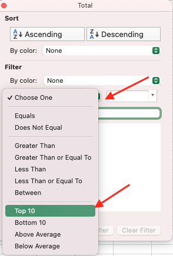

# Tasks
{: .no_toc }

  

    Table of contents
  

  {: .text-delta }
1. TOC
{:toc}

# Introduction

## Data import

*How to import .csv or .txt files into Excel*

Make sure to extract both files from the downloaded archive prior to the data import!

Step 1
{: .label .label-step}

Open new workbook.  

{: .step}

Step 2
{: .label .label-step}

Choose File -> Import in the Excel menu

{: .step}

Step 3
{: .label .label-step}

Select type **CSV file** and select the *bc-popular-boys-names.csv*

{: .step}

Step 4
{: .label .label-step}

In the Text Wizard select Delimited and choose Semicolon as the delimiter. Make sure that the preview looks correct

  

{: .step}

Step 5
{: .label .label-step}

We are only planning to use the data from the last 10 years (2010-2019). Therefore, the columns for 1920-2009 can be skipped. 

Click on the 1920 column and select **Do not import column**. Press Shift and scroll down to the column for 2009, click on it and click on **Do not import column** again. Make sure that only columns 1920-2009 are labeled as Skip. Other columns (Name, 2010, 2011, ..., 2019, Total) should be labeled General.

  

  

{: .step}

Step 6
{: .label .label-step}

Rename the current sheet to "Boys" and follow the same procedure for the Girls data (file *bc-popular-girls-names.csv*) 

{: .step}

## Data Operations

### Combining sheets

*Working with two (or more) sheets simultaneously* 

We now have two sheets with the same structure (Name, years 2010-2019 and Total) for boys and girls. 

Suppose we want to add another column **Max Year** to store the maximum value in the period 2010-2019 for each name. If the sheets have the same structure, we can do it simultaneously: 

Step 1
{: .label .label-step}

With *Boys* sheet open, press Shift and click on the *Girls* sheet. Make sure both sheets are selected:

{: .step}

Step 2
{: .label .label-step}

Continue to work on the *Boys* sheet. Add a name for the new column, for example, **Max Year**. 

{: .step}

Step 3
{: .label .label-step}

Add formula to the second cell to select the maximum over the ten years period.

Formula (click to open)

 
`=MAX(B2:K2)`

{: .step}

Step 4
{: .label .label-step}

Drag the formula down until the last row. 

Easy way to drag formula down

 
Double-click the bottom right of the cell (little square thingy that you usually drag down)

{: .step}

Step 5
{: .label .label-step}

Now switch over to the *Girls* sheet. The new column should appear there as well.

*Note*: Due to the difference in the number of rows, for *Girls* sheet formula is filled until the 2000th row. You can drag it down further manually or use shortcut from the previous step. 

{: .step}

### Index-Match

For **Max Year** column, it can be interesting to see not the maximum value itself, but rather the year during which this maximum value was captured. This may be done using a combination of INDEX() and MATCH() formulas.

Step 1
{: .label .label-step}

Select both sheets using Shift, similar to how we did it in the last exercise. 

{: .step}

Step 2
{: .label .label-step}

First, we need to find what column <u>matches</u> with the maximum value. To do that, we can use `MATCH()` function that has a following syntax:

`=MATCH(lookup_value, lookup_array, [match_type])`

Answer (click to open): 

 
`=MATCH(MAX(B2:K2),B2:K2,0)`

{: .step}

Step 3
{: .label .label-step}

After getting the index of a column that has a maximum value, we need to get the name of that column (or a year, corresponding to this column). Let's use `INDEX()` for that purpose:

`=INDEX(array, row_num, [column_num])`

Answer (click to open): 

 
`=INDEX(B1:K1,1,MATCH(MAX(B2:K2),B2:K2,0))`

{: .step}

Step 4
{: .label .label-step}

The combination of INDEX and MATCH gives us the exact year in which the maximum was reached. However, if we drag the formula now, the `array` argument for `INDEX` will change, so we need to fix it using the absolute references:

Answer (click to open): 

 
`=INDEX($B$1:$K$1,1,MATCH(MAX(B2:K2),B2:K2,0))`

{: .step}

Step 5
{: .label .label-step}

Drag the formula down to fill all the cells. 

{: .step}

### Named Range

In the formula for the **Max Year** we have an absolute reference to lookup the column names ($B$1:$K$1), and a relative reference to the number of uses corresponding to each individual row (B2:K2). 

For the usuability and overall clarity (for example, if you are sharing your workbook with someone else who may wonder what the formula means), we can fix the absolute reference and give it a name, similiar to creating variables when programming.

Step 1
{: .label .label-step}

On the Formulas tab select **Define Name**

{: .step}

Step 2
{: .label .label-step}

Enter a name for the data range, for example, *years*

{: .step}

Step 3
{: .label .label-step}

Since we are working simultaneously with two sheets it is better for the Named Range to be independent from the sheet name. Therefore, you can specify the following range:

`=$B$1:$K$1` (do not forget the equal sign in front)

Click OK.

{: .step}

Step 4
{: .label .label-step}

You can now rewrite the formula in the M2 using the *years* Named Range:

Answer (click to open): 

 
`=INDEX(years,1,MATCH(MAX(B2:K2),B2:K2,0))`

{: .step}

## Data Exploration

### Conditional Formatting

What we want to do next, is to explore our data and see how many what values are generally met there. We can use Conditional Formatting to highlight cells with colors depending on their values:

Step 1
{: .label .label-step}

Go to the Boys sheet and select columns A-K. While holding Ctrl (Cmd for Mac), unselect the column names, so they would not be included in the calculations.

{: .step}

Step 2
{: .label .label-step}

In the *Home* tab click on **Conditional Formatting** -> Top/Bottom Rules -> Bottom 10%.

Change the percent to be 1% and click OK.

{: .step}

We can see that there are many zeros in our data. We can use logical formula to fix that and select only values that have 10 non-zero observations.

### Logical Functions

Step 1
{: .label .label-step}

Create new column **Non-Zero Obs**. 

{: .step}

Step 2
{: .label .label-step}

We will use `COUNTIF` to get the number of non-zero inputs for each row. The functions uses the following syntax:

`COUNTIF(range,criteria)`

<u>Note</u>: When specifying criteria, use quotation marks ("").

Answer (click to open): 

 
`==COUNTIF($B2:$K2, ">0")`

{: .step}

Step 3
{: .label .label-step}

Drag the formula down. Ungroup the sheets and turn on the filter for the new column (Data -> Filter). Select only rows with 10 non-zero observations

{: .step}

### Sparklines

Another useful tool in data exploration is sparklines. For our workshop, we will only apply sparklines on a small sample of data from the Girls sheet.

Step 1
{: .label .label-step}

First, apply filter to the column names (Data -> Filter)

{: .step}

Step 2
{: .label .label-step}

Apply a filter for the Total column. Choose option **Top 10**, change number to be 1 and select percent instead of items. You should have 26 items selected.

{: .step}

Step 3
{: .label .label-step}

Select data for individual years (not including column names) and in the *Insert* tab select Sparklines

{: .step}

Step 3
{: .label .label-step}

Select data for individual years (not including column names) and in the *Insert* tab select Sparklines -> Line and select an empty column to place sparklines to

{: .step}

## Statistical Tests and Formulas

Excel may not only be used for exploratory data analysis, but is also capable of performing a range of statistical tests. We are going to use our baby names data to test a couple of theories.

Here is the first names of famous Canadians in 2014 and 2015, extracted from the [Google Trends](https://trends.google.com/trends/yis/2014/CA/):

First, we are going to export this data and find the number of corresponding name uses in BC.

### Data From Picture

There are some hiddens gems in Excel that not everyone is aware of. One of them is the ability to import the data from the picture (not only screenshots, but high-quality photos or scans).

Step 1
{: .label .label-step}

To start, save a picture to your computer and add a new sheet to the current workbook.

{: .step}

Step 2
{: .label .label-step}

In the *Data* tab, select **Data from Picture** -> Picture From File. Select the path to your file and click Open.

{: .step}

Step 3
{: .label .label-step}

When the upload is finished, Excel will give you an option to review the data. Since the data is a screenshot of another table, there is a little room for an error, so we can click on the Insert Data button.

{: .step}

Step 4
{: .label .label-step}

If the Data from Picture returns an error, save your file and restart the application. If you version of Excel does not support that feature, use prepared sheet from [here](https://github.com/ubc-library-rc/excel1/raw/main/content/trending_names.xlsx)

{: .step}

### XLOOKUP

We will now break the data in two periods and compare the use of names. Each period would include 4 years to account for possible fluctuation. One way to get the data for the period would be to first use VLOOKUP() and get the data for each year, then sum it up and compare the summaries. However, there is a simplier way of doing it by using XLOOKUP that returns an array:

Step 1
{: .label .label-step}

Add new column called 2010-2013. For the first name, use XLOOKUP() to get data for years 2010, 2011, 2012 and 2013.

Here is the syntax that XLOOKUP uses:

`**XLOOKUP(lookup_value, lookup_array, return_array, [if_not_found], [match_mode], [search_mode])** `

Do not forget to use absolute and relative references where applicable!

Answer (click to open): 

 
`=XLOOKUP($A2,Boys!$A$2:$A$2000,Boys!$B$2:$E$2000,0)`

{: .step}

Step 2
{: .label .label-step}

Drag the formula down. You will now see that when the name we search for is present in the data, the formula returns 4 values -- one for each year. To sum them up, we can use SUM() function. 

Your formula should now look like this (click to open): 

 
`=SUM(XLOOKUP($A2,Boys!$A$2:$A$2000,Boys!$B$2:$E$2000,0))`

{: .step}

Step 3
{: .label .label-step}

Write the formula for 2016-2019 period.

Your formula should now look like this (click to open): 

 
`=SUM(XLOOKUP($A2,Boys!$A$2:$A$2000,Boys!$H$2:$K$2000,0))`

{: .step}

### T-test

Suppose we have a following research question:

> Was there a difference between the use of trending names in two time periods?

To answer that, we can use a t-test. The research question itself suggests that we have a repetition: two observations for each name. Therefore, we would use a **paired t-test**.

Step 1
{: .label .label-step}

In the *Data* tab click on **Analysis Tool** and make sure that Analysis Toolpack is installed.

{: .step}

Step 2
{: .label .label-step}

Click on the Data Analysis (the icon should appear next to the Analysis Tool in the Data tab) and select **t-Test: Paired Two Sample for Means**

{: .step}

Step 3
{: .label .label-step}

Select column values as variables and save output on the same sheet, below the table. Other parameters would be defaults: null hypothesis is that the difference is 0 and the alpha level is 0.05.

Show settings (click to open): 

 

{: .step}

Step 4
{: .label .label-step}

You are now able to see and analyze the output. T-tests in Excel perform both one-tail and two-tail options, however, the latter is generally preffered for the most cases. 

We can see that the two-tail p-value of 0.053 is slighly larger than our significance level, therefore, we cannot reject the null hypothesis and reach a conclusion based on that data.

{: .step}

### ANOVA

We have another column that has not been used yet -- *year*. What if we will rephrase our research question to be the following:

> Was there a difference between the use of trending names of 2014 vs trending names of 2015 in two time periods?

Now we have a variation in the group, so it is a good idea to use ANOVA. The observations are still not independent (as they are in fact repeated measures), so we need to account for that and choose an ANOVA with replication.

Step 1
{: .label .label-step}

Open *Data Analysis* and select **Anova: Two-Factor With Replication**

{: .step}

Step 2
{: .label .label-step}

The input range should include all three columns, as well as their labels. The number of rows per sample in our data is 8 (8 rows for 2014 and 8 rows for 2015). The alpha level is default and equal to 0.05. Save output to the same sheet.

Show settings (click to open): 

 

{: .step}

Step 3
{: .label .label-step}

We can now see if there is a significant difference between periods, accounting for the variation within-group. The results indicate that neither the sample variation (p=0.79), nor the between-periods (p=0.6), nor their interaction term (p=0.96) were statistically significant. 

{: .step}

### 
